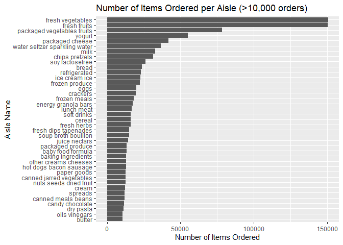
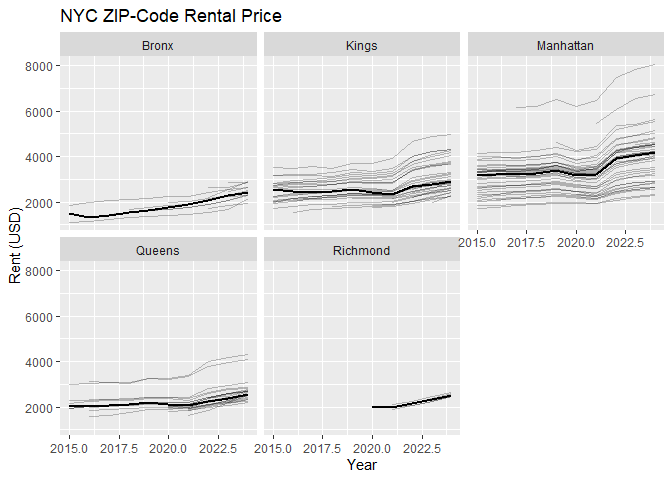
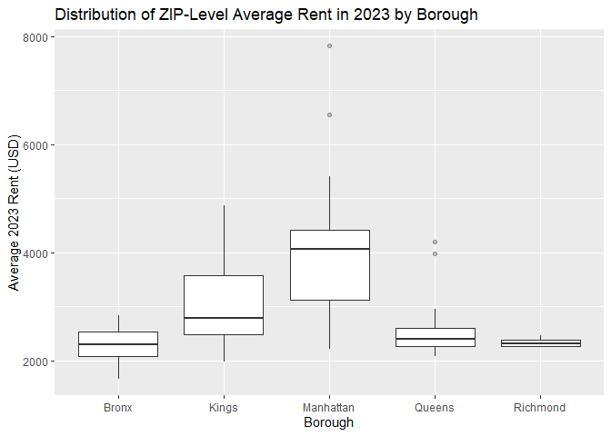
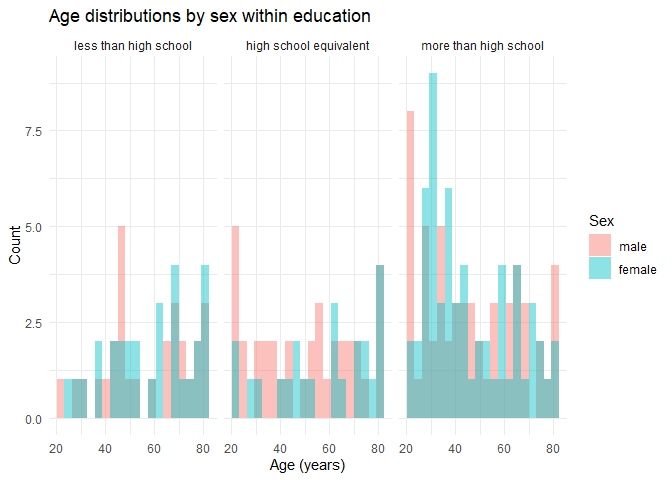
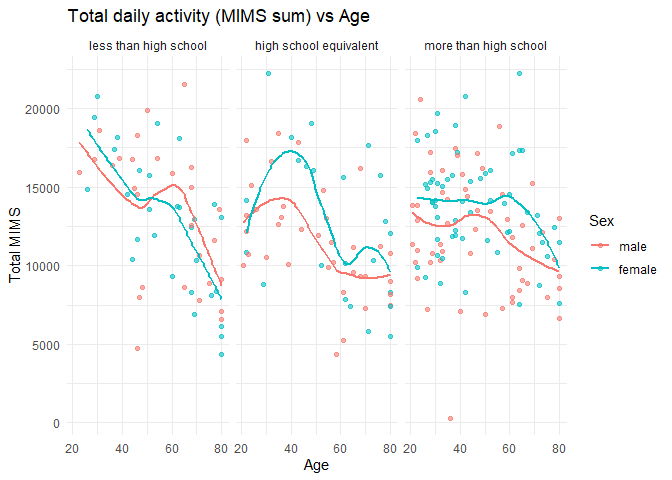
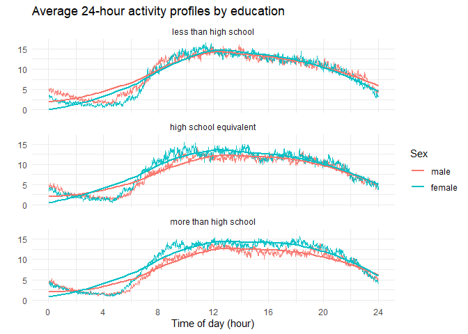

p8105_hw3_cd3591
================
Anny
2025-10-10

``` r
# set up libraries and the dataset
library(tidyverse)
```

    ## ── Attaching core tidyverse packages ──────────────────────── tidyverse 2.0.0 ──
    ## ✔ dplyr     1.1.4     ✔ readr     2.1.5
    ## ✔ forcats   1.0.0     ✔ stringr   1.5.1
    ## ✔ ggplot2   3.5.2     ✔ tibble    3.3.0
    ## ✔ lubridate 1.9.4     ✔ tidyr     1.3.1
    ## ✔ purrr     1.1.0     
    ## ── Conflicts ────────────────────────────────────────── tidyverse_conflicts() ──
    ## ✖ dplyr::filter() masks stats::filter()
    ## ✖ dplyr::lag()    masks stats::lag()
    ## ℹ Use the conflicted package (<http://conflicted.r-lib.org/>) to force all conflicts to become errors

``` r
library(patchwork)
library(p8105.datasets)
data("instacart")
```

# Problem 1

``` r
# basic structure of the dataset
str(instacart)
```

    ## tibble [1,384,617 × 15] (S3: tbl_df/tbl/data.frame)
    ##  $ order_id              : int [1:1384617] 1 1 1 1 1 1 1 1 36 36 ...
    ##  $ product_id            : int [1:1384617] 49302 11109 10246 49683 43633 13176 47209 22035 39612 19660 ...
    ##  $ add_to_cart_order     : int [1:1384617] 1 2 3 4 5 6 7 8 1 2 ...
    ##  $ reordered             : int [1:1384617] 1 1 0 0 1 0 0 1 0 1 ...
    ##  $ user_id               : int [1:1384617] 112108 112108 112108 112108 112108 112108 112108 112108 79431 79431 ...
    ##  $ eval_set              : chr [1:1384617] "train" "train" "train" "train" ...
    ##  $ order_number          : int [1:1384617] 4 4 4 4 4 4 4 4 23 23 ...
    ##  $ order_dow             : int [1:1384617] 4 4 4 4 4 4 4 4 6 6 ...
    ##  $ order_hour_of_day     : int [1:1384617] 10 10 10 10 10 10 10 10 18 18 ...
    ##  $ days_since_prior_order: int [1:1384617] 9 9 9 9 9 9 9 9 30 30 ...
    ##  $ product_name          : chr [1:1384617] "Bulgarian Yogurt" "Organic 4% Milk Fat Whole Milk Cottage Cheese" "Organic Celery Hearts" "Cucumber Kirby" ...
    ##  $ aisle_id              : int [1:1384617] 120 108 83 83 95 24 24 21 2 115 ...
    ##  $ department_id         : int [1:1384617] 16 16 4 4 15 4 4 16 16 7 ...
    ##  $ aisle                 : chr [1:1384617] "yogurt" "other creams cheeses" "fresh vegetables" "fresh vegetables" ...
    ##  $ department            : chr [1:1384617] "dairy eggs" "dairy eggs" "produce" "produce" ...
    ##  - attr(*, "spec")=
    ##   .. cols(
    ##   ..   order_id = col_integer(),
    ##   ..   product_id = col_integer(),
    ##   ..   add_to_cart_order = col_integer(),
    ##   ..   reordered = col_integer(),
    ##   ..   user_id = col_integer(),
    ##   ..   eval_set = col_character(),
    ##   ..   order_number = col_integer(),
    ##   ..   order_dow = col_integer(),
    ##   ..   order_hour_of_day = col_integer(),
    ##   ..   days_since_prior_order = col_integer(),
    ##   ..   product_name = col_character(),
    ##   ..   aisle_id = col_integer(),
    ##   ..   department_id = col_integer(),
    ##   ..   aisle = col_character(),
    ##   ..   department = col_character()
    ##   .. )

``` r
head(instacart) # illustrative examples of observations
```

    ## # A tibble: 6 × 15
    ##   order_id product_id add_to_cart_order reordered user_id eval_set order_number
    ##      <int>      <int>             <int>     <int>   <int> <chr>           <int>
    ## 1        1      49302                 1         1  112108 train               4
    ## 2        1      11109                 2         1  112108 train               4
    ## 3        1      10246                 3         0  112108 train               4
    ## 4        1      49683                 4         0  112108 train               4
    ## 5        1      43633                 5         1  112108 train               4
    ## 6        1      13176                 6         0  112108 train               4
    ## # ℹ 8 more variables: order_dow <int>, order_hour_of_day <int>,
    ## #   days_since_prior_order <int>, product_name <chr>, aisle_id <int>,
    ## #   department_id <int>, aisle <chr>, department <chr>

**Short Description**: The instacart dataset contains 1384617
observations of 15 variables, representing individual grocery orders
placed through the Instacart platform. Each observation corresponds to a
single product ordered by a user. Key variables include: order_id,
indicating unique identifier for each order; product_id & product_name,
identifying the product ordered; aisle_id / department_id, describing
where the product is found; order_hour_of_day, showing the time of order
placement; order_dow, indicating the day of week (0 = Sunday).

Q1

``` r
# How many aisles are there, and which aisles are the most items ordered from?
aisle = instacart %>% count(aisle, sort = TRUE)
n_aisle = nrow(aisle)
head(aisle, 3)
```

    ## # A tibble: 3 × 2
    ##   aisle                           n
    ##   <chr>                       <int>
    ## 1 fresh vegetables           150609
    ## 2 fresh fruits               150473
    ## 3 packaged vegetables fruits  78493

There are 134 aisles in total. The most frequently ordered aisles are
fresh vegetables, fresh fruits, and packaged vegetables fruits.

Q2

``` r
aisle %>%
  filter(n > 10000) %>%  # limiting this to aisles with more than 10000 items ordered
  mutate(aisle = fct_reorder(aisle, n)) %>%
  ggplot(aes(x = n, y = aisle)) +  # Make a plot that shows the number of items ordered in each aisle
  geom_col() +
  labs(title = "Number of Items Ordered per Aisle (>10,000 orders)",
       x = "Number of Items Ordered", y = "Aisle Name")   
```

<!-- -->

``` r
       # since there are long labels like “packaged vegetables fruits”, fit much better along the y-axis than rotated on the x-axis.
```

Q3

``` r
popular_items = instacart %>%  # Make a table
  filter(aisle == "baking ingredients" |
    aisle == "dog food care" |
    aisle == "packaged vegetables fruits") %>%  
  # in each of the aisles “baking ingredients”, “dog food care”, and “packaged vegetables fruits”
  group_by(aisle, product_name) %>%
  summarise(times_ordered = n(), .groups = "drop") %>%  # Include the number of times each item is ordered in your table
  slice_max(times_ordered, n = 3)  # showing the three most popular items

popular_items
```

    ## # A tibble: 3 × 3
    ##   aisle                      product_name         times_ordered
    ##   <chr>                      <chr>                        <int>
    ## 1 packaged vegetables fruits Organic Baby Spinach          9784
    ## 2 packaged vegetables fruits Organic Raspberries           5546
    ## 3 packaged vegetables fruits Organic Blueberries           4966

Q4

``` r
mean_hour = instacart %>%  # Make a table
  filter(product_name == "Pink Lady Apples" | 
           product_name == "Coffee Ice Cream") %>%  # at which Pink Lady Apples and Coffee Ice Cream
  group_by(product_name, order_dow) %>%  # ordered on each day of the week
  summarise(mean_hour = mean(order_hour_of_day), .groups = "drop") %>%  # showing the mean hour of the day
  pivot_wider(names_from = order_dow, values_from = mean_hour) %>%  # produce a 2 x 8 table
  rename(Sun = "0", Mon = "1", Tue = "2", Wed = "3", Thu = "4", Fri = "5", Sat = "6")

mean_hour
```

    ## # A tibble: 2 × 8
    ##   product_name       Sun   Mon   Tue   Wed   Thu   Fri   Sat
    ##   <chr>            <dbl> <dbl> <dbl> <dbl> <dbl> <dbl> <dbl>
    ## 1 Coffee Ice Cream  13.8  14.3  15.4  15.3  15.2  12.3  13.8
    ## 2 Pink Lady Apples  13.4  11.4  11.7  14.2  11.6  12.8  11.9

# Problem 2

``` r
# read the dataset
zip_info = read.csv("Zip Codes.csv", na = c("NA", ".", ""))%>% 
  janitor::clean_names() # clean names
zori = read.csv("Zip_zori_uc_sfrcondomfr_sm_month_NYC.csv", na = c("NA", ".", ""))%>% 
  janitor::clean_names() # clean names

# tidy zori
zori_new = zori %>% pivot_longer(
  x2015_01_31:x2024_08_31, 
  names_to = "date",
  values_to = "ZORI",
  names_prefix = "x"
  ) %>%  # tidy the dates
  mutate(date = ymd(str_replace_all(date, "_", "-")),
         zip_code  = as.integer(region_name)
         ) 

# collapse zip_info to one row per ZIP to avoid many-to-many
zip_info_one = zip_info %>%
  mutate(county = if_else(county == "New York", "Manhattan", county),
         zip_code = as.integer(zip_code)) %>%
  group_by(zip_code) %>%
  summarise(borough = first(county),
            neighborhood = str_c(sort(unique(neighborhood)), collapse = "; "),
            .groups = "drop") %>%
  dplyr::mutate(neighborhood = dplyr::na_if(neighborhood, ""))  # identify the empty is NA

#merge together
NY_zori = zori_new %>%
  left_join(zip_info_one,
            by = "zip_code") %>%
  dplyr::mutate(neighborhood = dplyr::na_if(neighborhood, "")) %>%  # identify the empty is NA
  arrange(zip_code, date) %>%
  relocate(zip_code, date, ZORI)
```

Q1

``` r
ny_1501_2408 = NY_zori %>%
  filter(date >= ymd("2015-01-01"), date <= ymd("2024-08-31"))  # filter the date between January 2015 and August 2024

zip_counts = ny_1501_2408 %>%
  count(zip_code, name = "n_months")  # create the counts of zip table

n_116  = sum(zip_counts$n_months == 116)  # How many ZIP codes are observed 116 times?

n_lt10 = sum(zip_counts$n_months < 10)  #How many are observed fewer than 10 times?

# There are 116 months between January 2015 and August 2024. How many ZIP codes are observed 116 times? How many are observed fewer than 10 times? Why are some ZIP codes are observed rarely and others observed in each month?
```

There are 149 ZIP codes observed 116 times and there are 0 observed
fewer than 10 times. Some ZIP codes don’t have many rental listings,
like some small or mostly owner-occupied areas. When there isn’t enough
data in a month, Zillow may leave it missing. By contrast, ZIP codes
with consistent, high listing volume (dense residential areas) have
enough data every month, so they’re observed in all 116 months.

Q2

``` r
average_rental = NY_zori %>%
  mutate(year = year(date)) %>%
  group_by(borough, year) %>%  # showing the average rental price in each borough and year (not month)
  summarise(avg_rent = mean(ZORI, na.rm = TRUE), .groups = "drop") %>%
  pivot_wider(names_from = year, values_from = avg_rent) %>%
  arrange(borough) %>%
  knitr::kable()

average_rental
```

| borough   |     2015 |     2016 |     2017 |     2018 |     2019 |     2020 |     2021 |     2022 |     2023 |     2024 |
|:----------|---------:|---------:|---------:|---------:|---------:|---------:|---------:|---------:|---------:|---------:|
| Bronx     | 1759.595 | 1520.194 | 1543.599 | 1639.430 | 1705.589 | 1811.443 | 1857.777 | 2054.267 | 2285.459 | 2496.896 |
| Kings     | 2492.928 | 2520.357 | 2545.828 | 2547.291 | 2630.504 | 2555.051 | 2549.890 | 2868.199 | 3015.184 | 3125.657 |
| Manhattan | 3022.042 | 3038.818 | 3133.848 | 3183.703 | 3310.408 | 3106.517 | 3136.632 | 3778.375 | 3932.610 | 4078.440 |
| Queens    | 2214.707 | 2271.955 | 2263.303 | 2291.918 | 2387.816 | 2315.632 | 2210.787 | 2406.038 | 2561.615 | 2693.584 |
| Richmond  |      NaN |      NaN |      NaN |      NaN |      NaN | 1977.608 | 2045.430 | 2147.436 | 2332.934 | 2536.442 |

**Comments**: During 2015.01–2024.08, Manhattan is consistently the most
expensive borough, followed by Brooklyn, Queens, and the Bronx, with
Richmond slightly above the Bronx once data appear in 2020. Rents
generally rose from 2015 to 2019, flattened around 2020–2021, and then
rebounded sharply to new highs by 2024 in every borough. The surge after
2021 is the strongest in Manhattan, widening the gap between high- and
lower-priced areas. Early years for Richmond are missing, which is why
those cells show NaN.

Q3

``` r
# Make a plot showing NYC Rental Prices within ZIP codes for all available years.
nyc_rental_plot = NY_zori %>%
  mutate(year = year(date)) %>%
  group_by(zip_code, borough, year) %>%
  summarise(rent = mean(ZORI, na.rm = TRUE), .groups = "drop") %>%
  ggplot(aes(x = year, y = rent, group = zip_code)) +
  geom_line(alpha = 0.25, na.rm = TRUE) +
  stat_summary(aes(group = borough), fun = median, geom = "line", linewidth = 1, na.rm = TRUE) +
  facet_wrap(~ borough, ncol = 3) +  # facilitate comparisons across boroughs
  labs(title = "NYC ZIP-Code Rental Price",
       x = "Year", y = "Rent (USD)")

nyc_rental_plot
```

<!-- -->

**Comments**: From the graph, rents rose slowly from 2015 to 2019,
flattened around 2020–2021, and then jumped sharply after 2021,
especially in Manhattan. Each thin line indicates the rents of each zip
code. Manhattan was always the most expensive and showed the widest
spread across ZIP codes, indicating large within-borough differences.
Brooklyn came next and also showed noticeable spread; Queens sat in the
middle with more moderate levels and variation. The Bronx was
consistently the lowest, with tighter clustering of ZIPs. Richmond
appeared only from about 2020 onward and tracked just above the Bronx.
The thick line (borough median) in each panel highlighted these
patterns: rebounds pushed all borough medians to new highs by the end of
2021, and the gap between Manhattan and lower-priced boroughs widened.

Q4

``` r
# Compute the average rental price within each ZIP code over each month in 2023
avg_2023 = NY_zori %>%
  filter(year(date) == 2023) %>%
  group_by(zip_code, borough) %>%
  summarise(avg_2023 = mean(ZORI, na.rm = TRUE), .groups = "drop")

# Make a reader-friendly plot showing the distribution of ZIP-code-level rental prices across boroughs
avg_2023_pplot = ggplot(avg_2023, aes(x = borough, y = avg_2023)) +  
  # facilitate the comparison of the distribution of average rental prices across boroughs
  geom_boxplot(outlier.alpha = 0.3, na.rm = TRUE) +
  labs(title = "Distribution of ZIP-Level Average Rent in 2023 by Borough",
       x = "Borough", y = "Average 2023 Rent (USD)")

avg_2023_pplot
```

<!-- -->

**Comments**: In 2023, rents were the highest and most uneven in
Manhattan, with several zip codes with very expensive rents pulling the
upper tail up. Brooklyn followed with a lower median than Manhattan but
still wide variation across ZIPs. Queens sat in the middle with moderate
rents and a few higher-priced outliers. Richmond was a bit higher than
the Bronx on median rent and showed the thinest box, suggesting uniform
prices across its ZIP codes.

Q5

``` r
# Combine the two previous plots into a single graphic
combine_plot = (nyc_rental_plot + avg_2023_pplot)

# export this to a results folder in your repository
dir.create("results", showWarnings = FALSE, recursive = TRUE)
ggsave("results/zillow_combined.png", width = 16, height = 8, dpi = 320)
```

# Problem 3

Q1

``` r
# import the datasets
covar = read_csv("nhanes_covar.csv", na = c("NA", ".", "")) %>%
  janitor::clean_names()  # clean names
```

    ## New names:
    ## Rows: 254 Columns: 5
    ## ── Column specification
    ## ──────────────────────────────────────────────────────── Delimiter: "," chr
    ## (5): ...1, 1 = male, ...3, ...4, 1 = Less than high school
    ## ℹ Use `spec()` to retrieve the full column specification for this data. ℹ
    ## Specify the column types or set `show_col_types = FALSE` to quiet this message.
    ## • `` -> `...1`
    ## • `` -> `...3`
    ## • `` -> `...4`

``` r
accel = read_csv("nhanes_accel.csv", na = c("NA", ".", "")) %>%
  janitor::clean_names()   # clean names
```

    ## Rows: 250 Columns: 1441
    ## ── Column specification ────────────────────────────────────────────────────────
    ## Delimiter: ","
    ## dbl (1441): SEQN, min1, min2, min3, min4, min5, min6, min7, min8, min9, min1...
    ## 
    ## ℹ Use `spec()` to retrieve the full column specification for this data.
    ## ℹ Specify the column types or set `show_col_types = FALSE` to quiet this message.

``` r
# tidy covar dataset
covar_fixed = covar %>%
  janitor::row_to_names(row_number = 4) %>%  # use row 4 as column names
  slice(-(1:4)) %>%  # remove the first 4 rows
  janitor::clean_names() %>%  # make nice: seqn, sex, age, bmi, education
  mutate(
    age = as.integer(age),
    bmi = as.numeric(bmi),
    seqn = as.character(seqn),
    sex = fct_recode(as.factor(sex),
                     "male"   = "1",
                     "female" = "2"),  # change 1 to male; 2 to female
    education = fct_recode(as.factor(education),
                           "less than high school" = "1", 
                           "high school equivalent" = "2", 
                           "more than high school" = "3")  
    #change 1 = less than high school; 2 = high school equivalent; 3 = more than high school
  )

# exclude participants less than 21 years of age, and those with missing demographic data
covar_clean = covar_fixed %>%
  filter(!is.na(seqn), !is.na(sex), !is.na(age), !is.na(education), age >= 21)

# tidy accel
accel = accel %>% 
  mutate(seqn = as.character(seqn))

# merge covar and accel
minute_cols = names(accel %>% select(starts_with("min")))

mims_data = covar_clean %>%
  inner_join(accel %>% select(seqn, all_of(minute_cols)), by = "seqn")
  
mims_data
```

    ## # A tibble: 227 × 1,445
    ##    seqn  sex      age   bmi education     min1   min2   min3  min4   min5   min6
    ##    <chr> <fct>  <int> <dbl> <fct>        <dbl>  <dbl>  <dbl> <dbl>  <dbl>  <dbl>
    ##  1 62177 male      51  20.1 high school… 6.14  8.06   9.99   6.60  4.57   2.78  
    ##  2 62178 male      80  28.5 high school… 0.167 0.429  0.131  1.20  0.0796 0.0487
    ##  3 62180 male      35  27.9 more than h… 0.039 0      0      0     0.369  0.265 
    ##  4 62184 male      26  22.1 high school… 1.55  2.81   3.86   4.76  6.10   7.61  
    ##  5 62189 female    30  22.4 more than h… 2.81  0.195  0.163  0     0.144  0.180 
    ##  6 62191 male      70  NA   high school… 2.84  2.44   2.36   1.87  2.33   1.63  
    ##  7 62199 male      57  28   more than h… 0.031 0.0359 0.0387 0.079 0.109  0.262 
    ##  8 62202 male      36  24.7 less than h… 3.68  3.28   4.37   4.03  1.63   2.82  
    ##  9 62205 male      28  28.9 more than h… 6.81  8.65   6.77   9.52  7.78   9.78  
    ## 10 62206 female    35  29.1 more than h… 1.27  2.22   0.845  1.02  0.414  0.283 
    ## # ℹ 217 more rows
    ## # ℹ 1,434 more variables: min7 <dbl>, min8 <dbl>, min9 <dbl>, min10 <dbl>,
    ## #   min11 <dbl>, min12 <dbl>, min13 <dbl>, min14 <dbl>, min15 <dbl>,
    ## #   min16 <dbl>, min17 <dbl>, min18 <dbl>, min19 <dbl>, min20 <dbl>,
    ## #   min21 <dbl>, min22 <dbl>, min23 <dbl>, min24 <dbl>, min25 <dbl>,
    ## #   min26 <dbl>, min27 <dbl>, min28 <dbl>, min29 <dbl>, min30 <dbl>,
    ## #   min31 <dbl>, min32 <dbl>, min33 <dbl>, min34 <dbl>, min35 <dbl>, …

Q2

``` r
# Produce a reader-friendly table for the number of men and women in each education category
counts_tbl = covar_clean %>%
  count(education, sex, name = "n") %>%
  arrange(education, sex) %>% 
  pivot_wider(names_from = sex, values_from = n) %>%
  knitr::kable(caption = "Counts by education and sex (adults only)")

counts_tbl
```

| education              | male | female |
|:-----------------------|-----:|-------:|
| less than high school  |   28 |     29 |
| high school equivalent |   34 |     23 |
| more than high school  |   55 |     58 |

Counts by education and sex (adults only)

``` r
# create a visualization of the age distributions for men and women in each education category
ggplot(covar_clean, aes(x = age, fill = sex)) +
  geom_histogram(position = "identity", alpha = 0.45, bins = 20) +
  facet_wrap(~ education, ncol = 3) +
  labs(title = "Age distributions by sex within education",
       x = "Age (years)", y = "Count", fill = "Sex") +
  theme_minimal()
```

<!-- -->

**Comments**: From the table, men and women were about even in less than
high school (28 vs 29) and in more than high school (55 vs 58), while
high school equivalent was male-heavy (34 men vs 23 women). From the age
plots, the male and female distributions overlapped a lot within each
education group and there was no major age shift by sex. Moreover, in
more than high school women clustered a bit more in their 20s–40s and
men were slightly more spread out, but the differences were small.

Q3

``` r
# aggregate across minutes to create a total activity variable for each participant
totals = mims_data %>%
  mutate(total_activity = rowSums(across(all_of(minute_cols)), na.rm = TRUE))

# Plot these total activities (y-axis) against age (x-axis)
ggplot(totals, aes(x = age, y = total_activity, color = sex)) +  # compare men to women
  geom_point(alpha = 0.6) +
  geom_smooth(se = FALSE, method = "loess") +  # Include a trend line or a smooth to illustrate differences.
  facet_wrap(~ education, ncol = 3) +  # have separate panels for each education level
  labs(title = "Total daily activity (MIMS sum) vs Age",
       x = "Age", y = "Total MIMS", color = "Sex") +
  theme_minimal()
```

    ## `geom_smooth()` using formula = 'y ~ x'

<!-- -->

**Comments**: Across all three education groups, total daily activity
generally went down as age went up. In more than high school and less
than high school, the decline was steady from the 20s/30s into older
ages. In high school equivalent, there was a small mid-life bump (around
the 30s–40s) before activity dropped in later years. Men and women
looked very similar overall. In specific, their smooth lines sat close
together, though women were a tad higher in activity in parts of the
middle ages in the high school equivalent and more than high school
panels. The main trend is the age-related decline, with only small sex
differences.

Q4

``` r
# tidy the mims_data for the preparing for the plot
mims_long = mims_data %>%
  select(seqn, sex, education, all_of(minute_cols)) %>%
  pivot_longer(all_of(minute_cols), names_to = "minute", values_to = "mims") %>%
  mutate(minute_num = readr::parse_number(minute)) %>%
  filter(dplyr::between(minute_num, 1, 1440))

prof = mims_long %>%
  group_by(education, sex, minute_num) %>%
  summarise(mims_mean = mean(mims, na.rm = TRUE), .groups = "drop")

# three-panel plot that shows the 24-hour activity time courses
ggplot(prof, aes(x = minute_num, y = mims_mean, color = sex)) +  # use color to indicate sex
  geom_line(alpha = 0.9) +
  geom_smooth(se = FALSE, method = "loess") +
  facet_wrap(~ education, ncol = 1) +  # for each education level
  scale_x_continuous(breaks = seq(0, 1440, 240)) +
  labs(title = "Average 24-hour activity profiles by education",
       x = "Time of day", y = "Mean MIMS/min", color = "Sex") +
  theme_minimal()
```

    ## `geom_smooth()` using formula = 'y ~ x'

<!-- -->

**Comments**: Across all three education groups, activity was the lowest
overnight, then rose sharply in the morning, peaked around mid-day till
early afternoon, and then gradually declined into the evening. The daily
shape was very similar everywhere. The highest mid-day levels appeared
in the less than high school group, the high school equivalent group was
close behind, and more than high school was a bit lower overall with a
slightly later rise. Men and women followed nearly the same pattern; any
sex differences were small. In specific, women tended to be slightly
higher during the day in the high school equivalent and more than high
school groups, while men were a touch higher very early in the morning
in the less than high school group.
